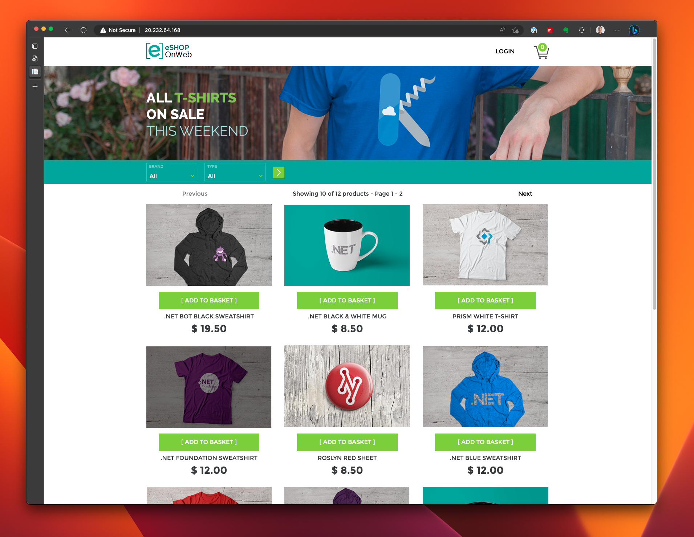

# Use GitHub Copilot to create GitHub Action Workflows

GitHub Copilot is a new AI-powered code completion tool that helps you write code faster. It's available in Visual Studio, Visual Studio Code, and with GitHub Codespaces.

This workshop offers a comprehensive tutorial on how to utilize Copilot for creating GitHub Action Workflows.

The GitHub Action Workflow we will be building can be briefly summarized as follows:

1. Build and test .NET solution
1. Containerize the `Web` and `API` apps and push containers to Azure Container Registry
1. Deploy application to Azure Kubernetes Service

---

## Prerequisites

| | |
|----------------------|------------------------------------------------------|
| Git | [Install Git](https://git-scm.com/downloads) |
| GitHub Account | [ Get a free GitHub account](https://github.com/) |
| GitHub CLI | [Install GitHub CLI](https://cli.github.com/) |
| GitHub Copilot | [Sign-up for GitHub Copilot](https://copilot.github.com/) |
| Azure subscription | [Sign up for a free Azure subscription](https://azure.microsoft.com/free/) |
| Azure CLI | [Install Azure CLI](https://docs.microsoft.com/cli/azure/install-azure-cli) |
| Visual Studio Code | [Install Visual Studio Code](https://code.visualstudio.com/) |
| GitHub Copilot Visual Studio Code Extension | [GitHub Copilot Visual Studio Marketplace](https://marketplace.visualstudio.com/items?itemName=GitHub.copilot) |

---

## Set your environment

Fork and clone this repository, then open in [Visual Studio Code (VS Code)](https://code.visualstudio.com/). Ensure you have the [GitHub Copilot extension](https://marketplace.visualstudio.com/items?itemName=GitHub.copilot) installed and sign into GitHub to enable the extension.

Run the following commands to deploy the Azure resources and set some variables which will be used later.

```bash
# create azure resources
az deployment sub create --template-file ./deploy/main.bicep --location eastus --parameters 'resourceGroup=gh-copilot-demo'
ACR_NAME=$(az deployment sub show --name main --query 'properties.outputs.acr_name.value' -o tsv)
AKS_NAME=$(az deployment sub show --name main --query 'properties.outputs.aks_name.value' -o tsv)
RG_NAME=$(az deployment sub show --name main --query 'properties.outputs.resource_group_name.value' -o tsv)

# set your github variables
APP_NAME=gh-copilot-demo
REPO=<YOUR_GITHUB_ORG_OR_ACCOUNT>/eShopOnAKS
BRANCH=main
```

Create a service principal and assign the `Owner` role to the service principal. This will allow the service principal to create resources in your Azure subscription.

```bash
# create service principal
APP_OBJECT_ID=$(az ad app create --display-name ${APP_NAME} --query id -o tsv)
USER_OBJECT_ID=$(az ad sp create --id $APP_OBJECT_ID --query id -o tsv)

# assign role to service principal
az role assignment create --role "Owner" --assignee-object-id $USER_OBJECT_ID
```

Create a federated credential for the app registration. This will allow the app registration to authenticate to GitHub without needing to store the client secret in the workflow.

```bash
# create the federated credential for the app registration
az ad app federated-credential create \
   --id $APP_OBJECT_ID \
   --parameters "{\"name\":\"${APP_NAME}\",\"issuer\":\"https://token.actions.githubusercontent.com\",\"subject\":\"repo:${REPO}:ref:refs/heads/${BRANCH}\",\"audiences\":[\"api://AzureADTokenExchange\"]}"
```

Set secrets in your repo. These secrets will be used throughout your GitHub Action workflow.

```bash
# set secrets in your repo
gh repo set-default
gh secret set AZURE_CLIENT_ID --body "$(az ad app show --id $APP_OBJECT_ID --query appId -o tsv)" --repo $REPO
gh secret set AZURE_TENANT_ID --body "$(az account show --query tenantId -o tsv)" --repo $REPO
gh secret set AZURE_SUBSCRIPTION_ID --body "$(az account show --query id -o tsv)" --repo $REPO
gh secret set AZURE_USER_OBJECT_ID --body "${USER_OBJECT_ID}" --repo $REPO
gh secret set ACR_NAME --body $ACR_NAME --repo $REPO
gh secret set AKS_NAME --body $AKS_NAME --repo $REPO
gh secret set RG_NAME --body $RG_NAME --repo $REPO
```

---

## Workflow Setup

In your VS Code editor, open the [`.github/workflows/dotnetcore.yml`](../.github/workflows/dotnetcore.yml) file. This is the workflow we'll be using to build and deploy our application. It's already setup to build and test the .NET solution, but we need to add the steps to containerize and deploy the application to AKS.

### Environment variables

Near the top of the file, just above `jobs:` (on line # 5), add an environment variable to hold your Azure Container Registry (ACR) name. 

Use Copilot to help you with the syntax. A good way to invoke Copilot is by using comments to describe what we'd like the end state to be.

Copilot prompt:

```yaml
# environment variable for ACR_NAME
```
<details>
<summary>Copilot suggestion:</summary>

```yaml
env:
  ACR_NAME: '${{ secrets.ACR_NAME }}'
```
</details>

Both Copilot and other Large Language Models (LLMs) such as ChatGPT function based on the principles of probability. After analyzing the situation, they predict with a high level of certainty that referencing a [GitHub Action Secret](https://docs.github.com/en/actions/reference/encrypted-secrets) in the workflow is a common practice that many users prefer.

To accept a Copilot code suggestion, press the tab key on your keyboard to accept the entire suggestion or if want more granular control in what you accept, you can press the "command/ctrl" and "right-arrow" key to accept suggestions one word at a time.

### OIDC token permissions

We'll also be using [Azure Federated Identity Credentials](https://learn.microsoft.com/graph/api/resources/federatedidentitycredentials-overview?view=graph-rest-1.0) to authenticate to Azure so we need to add permissions for the action to write `id-token` and read `contents`.

Just below the `env:` section, add a new comment/prompt to the file and have Copilot help you with the syntax.

Copilot prompt:

```yaml
# add permissions for the action to write id-tokens and read contents
```

<details>
<summary>Copilot suggestion:</summary>

```yaml
permissions:
  id-token: write
  contents: read
```
</details>

---

## Build and publish Web container

We are now ready to add additional [GitHub Action jobs](https://docs.github.com/en/actions/using-jobs) to build and publish the Web and API containers to Azure Container Registry (ACR).

Scroll to the end of the [`.github/workflows/dotnetcore.yml`](../.github/workflows/dotnetcore.yml) file and add a new job to publish our container images. 

### Add a new `publish` job

Start by entering a new line to add a new `publish:` job. 

<div class="warning" data-title="Warning">

> YAML is very particular about indentation, make sure your new `publish:` job aligns with the `build:` job.

</div>

In addition to comments, actual code can be used to invoke Copilot. So if you know the exact syntax, simply start typing it and Copilot will help you fill in the blanks.

Copilot prompt:

```yaml
publish: # hit enter after this
```

<details>
<summary>Copilot suggestion:</summary>

```yaml
  needs: build
```
</details>

Copilot may suggest a large amount of code. You have to take these suggestions with a grain of salt as they may result in unintended consequences. Using our ability to pick individual words to accept, let's only accept the `needs: build` line. This line tells the workflow that the `publish` job relies on `build`. Hit the enter key again to see what else Copilot suggests.

Copilot prompt:

```yaml
# No prompt, just create a new line after accepting `needs: build`
```

<details>
<summary>Copilot suggestion:</summary>

```yaml
  runs-on: ubuntu-latest
```
</details>

After `runs-on: ubuntu-latest` enter a new line to add a new `steps:` section.

Copilot prompt:

```yaml
# No prompt, just create a new line after accepting `runs-on: ubuntu-latest`
```

<details>
<summary>Copilot suggestion:</summary>

```yaml
  steps:
    - uses: actions/checkout@v2
```
</details>

After a series of tab completions and line returns to accept Copilot's suggestions, we should have this.

```yaml
publish:
  needs: build
  runs-on: ubuntu-latest
  steps:
    - uses: actions/checkout@v2
```

### Login to Azure

In this job, we'll be publishing to ACR, so we'll need to log into Azure and our ACR. Add a new line after `- uses: actions/checkout@v2` and add a comment to indicate we'll be logging in to Azure using our federated credential.

Copilot prompt:

```yaml
# login to azure
```

<details>
<summary>Copilot suggestion:</summary>

```yaml
    - name: Login to Azure using Federated Managed Identity
      uses: azure/login@v1
      with:
        creds: ${{ secrets.AZURE_CREDENTIALS }}
```
</details>

Logging into Azure using federated credentials a fairly practice and not as common as logging in using `creds` and `${{ secrets.AZURE_CREDENTIALS }}`. This is no longer recommended for GitHub Actions as the `AZURE_CREDENTIALS` which gets passed into `creds` contains a client secret which requires periodic rotation in Azure AD and updated in your repo. Therefore, using federated credentials is a more secure approach and requires less maintenance in the long run. 

Manually replace `creds: ${{ secrets.AZURE_CREDENTIALS }}` with the following:

```yaml
client-id: ${{ secrets.AZURE_CLIENT_ID }}
tenant-id: ${{ secrets.AZURE_TENANT_ID }}
subscription-id: ${{ secrets.AZURE_SUBSCRIPTION_ID }}
```

### Login to ACR

Next step will be to log into ACR using the `az acr login` Azure CLI command. Add a new comment to indicate we'll be logging into ACR.

Copilot prompt:

```yaml
# run az acr login command
```

<details>
<summary>Copilot suggestion:</summary>

```yaml
    - name: Login to Azure Container Registry
      run: |
        az acr login --name ${{ env.ACR_NAME }}
```
</details>

### Build the Web container

We're ready to build, scan and push container images. Add a new step and begin with a comment to indicate we want to run a `docker build` command.

Copilot prompt:

```yaml
# run docker build command on file src/Web/Dockerfile to build web image tagged as web:${{ github.sha }}
```

<details>
<summary>Copilot suggestion:</summary>

```yaml
    - name: Build web image
      run: docker build -f src/Web/Dockerfile -t ${{ env.ACR_NAME }}.azurecr.io/web:${{ github.sha }} .
```
</details>

### Scan the Web container

Before we push the image to ACR, we need to scan it for vulnerabilities and check for best practices. 

Add a new comment to indicate we'll be scanning the container image using the [aquasecurity/trivy-action](https://github.com/marketplace/actions/aqua-security-trivy) GitHub Action.

Copilot prompt:

```yaml
# scan container web:${{ github.sha }} using aquasecurity/trivy-action@master and ignore errors for now
```

<details>
<summary>Copilot suggestion:</summary>

```yaml
    - name: Scan web image
      uses: aquasecurity/trivy-action@master
      with:
        image-ref: ${{ env.ACR_NAME }}.azurecr.io/web:${{ github.sha }}
        exit-code: 0
```
</details>

Next run checks against the container image for best practices and against CIS Benchmarks. Add a new comment to indicate we'll be running checks against the container image using the [erzz/dockle-action](https://github.com/marketplace/actions/dockle-action).

Copilot prompt:

```yaml
# run checks against the web container image using erzz/dockle-action@v1 and ignore errors for now
```

<details>
<summary>Copilot suggestion:</summary>

```yaml
    - name: Run dockle
      uses: erzz/dockle-action@v1
      with:
        image: ${{ env.ACR_NAME }}.azurecr.io/web:${{ github.sha }}
```
</details>

### Push the Web container to ACR

When the image scan and checks are successful it should be pushed to ACR. Add a new comment to use the `docker push` command to push the container image to ACR.

Copilot prompt:

```yaml
# use docker push to push the web container image to acr
```
<details>
<summary>Copilot suggestion:</summary>

```yaml
    - name: Push container image to Azure Container Registry
      run: |
        docker push ${{ env.ACR_NAME }}.azurecr.io/eshopweb:${{ github.sha }}
```
</details>

With the Web application container published, we can repeat the steps and do the same for the PublicApi application.

---

## Build and publish API container

We can continue to add steps to our `publish` job. With the previous steps we have already added, Copilot will use that as additional context and provide suggestions similar to what we've already added. So this will be much smoother 😎

### Build the API container

Start by adding a new line then add a new comment to build the PublicApi container image.

Copilot prompt:

```yaml
# docker build on src/PublicApi/Dockerfile to build web image tagged as api:${{ github.sha }}
```

<details>
<summary>Copilot suggestion:</summary>

```yaml
    - name: Build api image
      run: docker build -f src/PublicApi/Dockerfile -t ${{ env.ACR_NAME }}.azurecr.io/api:${{ github.sha }} .
```
</details>

### Scan and push the API container to ACR

Add a new line and watch Copilot add it's own comment and start filling in the details.

At this point, Copilot use the code we just added as context and will suggest to scan the PublicApi container image then push the container to ACR. It will even suggest the comments too! So you can just accept the suggestions until you reach the step where you use `docker push` to push the publicapi container image.

Copilot prompt:

```yaml
# No prompt, simply let Copilot make suggestions and accept
```

<details>
<summary>Copilot suggestion:</summary>

```yaml
    # scan container api:${{ github.sha }} using aquasecurity/trivy-action
    - name: Scan api image
      uses: aquasecurity/trivy-action@master
      with:
        image-ref: ${{ env.ACR_NAME }}.azurecr.io/api:${{ github.sha }}
    # run checks against the api container image using erzz/dockle-action
    - name: Run dockle
      uses: erzz/dockle-action@v1
      with:
        image: ${{ env.ACR_NAME }}.azurecr.io/api:${{ github.sha }}
    # use docker push to push the api container image to acr
    - name: Push api image
      run: docker push ${{ env.ACR_NAME }}.azurecr.io/api:${{ github.sha }}
```
</details>

That was too easy! Copilot understood my intent and followed the pattern from the lines of code above and swapped out `web` with `api`. Add another new line and watch it add in the step to push the PublicApi container image to ACR.

---

## Deploy to AKS

Now that we have our container images built and pushed to ACR, we can deploy them to our AKS cluster.

We need to create a few more environment variables to store our `AKS_NAME` and `RG_NAME`. These variables will be used to authenticate to our AKS cluster.

### Add more environment variables

Scroll to the top of the [`.github/workflows/dotnetcore.yml`](../.github/workflows/dotnetcore.yml) file (line 5) and replace our initial comment with the one below. After you've updated the comment, add a new line after `ACR_NAME: ${{ secrets.ACR_NAME }}` to have Copilot fill in the rest.

Copilot prompt:

```yaml
# environment variable for ACR_NAME, AKS_NAME and RG_NAME
```

<details>
<summary>Copilot suggestion:</summary>

```yaml
  AKS_NAME: ${{ secrets.AKS_NAME }}
  RG_NAME: ${{ secrets.RG_NAME }}
```
</details>

### Add a new `deploy` job

With the variables in place we can add a new `deploy` job at the bottom of the [`.github/workflows/dotnetcore.yml`](../.github/workflows/dotnetcore.yml) file.

Add a new line and make sure your cursor is aligned with the `publish` job and add a new comment to describe what this job will do. 

### Multi-line comments as prompts

Here we will be more descriptive in our intent and add multi-line comments to describe our goals.

Copilot prompt:

```yaml
# deploy job deploys manifests to aks cluster
# log into azure
# run az aks get-credentials command
# run kustomize edit set image to update web and api images from the ./manifests directory
# deploy manifests
```

<details>
<summary>Copilot suggestion:</summary>

```yaml
  deploy:
    needs: publish
    runs-on: ubuntu-latest
    steps:
    - uses: actions/checkout@v2
    - uses: azure/login@v1
      with:
        client-id: ${{ secrets.AZURE_CLIENT_ID }}
        tenant-id: ${{ secrets.AZURE_TENANT_ID }}
        subscription-id: ${{ secrets.AZURE_SUBSCRIPTION_ID }}
    - name: Get AKS credentials
      run: az aks get-credentials --resource-group ${{ env.RG_NAME }} --name ${{ env.AKS_NAME }}
    - name: Update web image
      run: kustomize edit set image ${{ env.ACR_NAME }}.azurecr.io/web:${{ github.sha }}
    - name: Update api image
      run: kustomize edit set image ${{ env.ACR_NAME }}.azurecr.io/api:${{ github.sha }}
    - name: Deploy to AKS
      run: kustomize build ./manifests | kubectl apply -f -
```
</details>

### Course correcting Copilot

This is good, but not perfect. It's good to see that Copilot knew to use federated identity credentials to log into Azure and run the `az aks get-credentials` command but there are a few things we need to tweak.

Remove the step with name "Login to Azure Container Registry" since it is not needed.

The `kustomize edit set image` commands in the the "Update web image" and "Update api image" steps are not quite right either. We need to specify the original name so that kustomize can find the image to update. The deployment manifests point to `notavalidregistry.azurecr.io/web` and `notavalidregistry.azurecr.io/api` so we need to update the commands to reflect that.

Update the `kustomize edit set image` commands update specific images in the existing deployment manifests. You can combine the last 3 commands into a single `run` step so that we only need to specify the working directory to `manifests` in a single step (not 3). 

Your final result should look like the following:

```yaml
- name: Update image tags and deploy to AKS
  run: |
    kustomize edit set image notavalidregistry.azurecr.io/web=${{ env.ACR_NAME }}.azurecr.io/web:${{ github.sha }}
    kustomize edit set image notavalidregistry.azurecr.io/api=${{ env.ACR_NAME }}.azurecr.io/api:${{ github.sha }}
    kustomize build . | kubectl apply -f -
  working-directory: manifests
```

### Commit, push, and watch the build

Save, commit, and push to your remote repo.

```bash
git add .github/workflows/dotnetcore.yml
git commit -m "add publish job to build and push containers"
git push
```

In your web browser, navigate to your repo and watch the build run.

### Verify the deployment

If all went well, you should have a successful build 🎉

To verify, you can run `kubectl get svc` to get the public IP of your LoadBalancer and browse to the eShopOnWeb application.



<div class="tip" data-title="Tip">

> Sometimes the deployment to AKS can take a few minutes to complete. If you see the build succeed but the deployment fails, wait a few minutes and try again.
> You can also run the `kubectl rollout restart deployment/web && kubectl rollout restart deployment/api` commands to restart the Web and API deployments.

</div>

---

## Conclusion

By utilizing user comments and pre-existing code, Copilot can assist in constructing an automation workflow that seamlessly deploys your application to AKS. While it may not always generate flawless results, it provides valuable suggestions that can be refined and improved by the user. To further enhance accuracy, adding detailed comments to your code can assist Copilot in comprehending your intentions. In summary, Copilot is an exceptional tool to aid you in initiating your automation workflows.